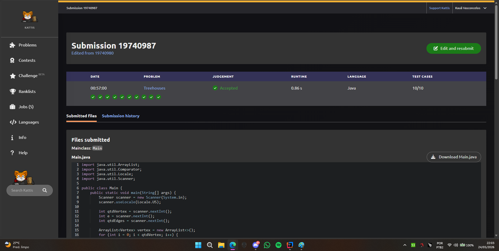

# 🏕️ Trabalho Prático 1 - Treehouses (Grupo C)

**Disciplina:** Resolução de Problemas com Grafos

**Orientador:** Prof. Me Ricardo Carubbi

**Instituição:** Universidade de Fortaleza (UNIFOR)

**Autor:** Pedro Kauã Vasconcelos, Eduardo Suaki e Robson Santos

---
## 📌 Sobre o Projeto
Este repositório contém a implementação em **Java** do Trabalho Prático 1 da disciplina de **Resolução de Problemas com Grafos**.

O objetivo central do projeto é calcular a quantidade mínima de cabo necessária para conectar uma rede de **casas na árvore (treehouses)**. 
A dificuldade do problema reside no fato de que algumas conexões já existem, ou seja, 
trata-se de um problema de **Árvore Geradora Mínima (MST)** com componentes pré-conectados.

O algoritmo implementado:
1. Cadastra todas as coordenadas (x, y) das casas na árvore.
2. Utiliza a estrutura **Union-Find (DSU)** para agrupar as primeiras $e$ casas e os $p$ pares de cabos já instalados (custo zero).
3. Calcula a distância euclidiana entre todos os pares de casas que ainda não pertencem ao mesmo conjunto.
4. Ordena essas possíveis conexões e aplica o algoritmo de **Kruskal** para finalizar a unificação da rede somando o menor custo possível.

## 🧠 Modelagem e Estratégia Algorítmica

Para resolver o problema, o enunciado foi convertido num grafo ponderado da seguinte maneira:

* **Vértices**: Cada casa na árvore representa um vértice, identificado por seu ID e coordenadas no plano 2D.

* **Arestas**: As conexões (cabos) representam as arestas. O grafo implícito é completo, pois em teoria qualquer casa pode ser ligada a qualquer outra.

* **Pesos**: O custo de cada aresta é a distância geométrica (euclidiana) entre as duas casas conectadas.

## 📔 O Papel do Union-Find (DSU) e Kruskal
A estratégia central é utilizar o algoritmo de Kruskal aliado ao Union-Find. O DSU desempenha dois papéis críticos aqui:

1. **Fase de Inicialização**: Antes de calcular os pesos, o método `union()` é usado para fundir as casas que já possuem conexão (as $e$ iniciais e as $p$ extras). 
Elas se tornam "ilhas" consolidadas sem custo adicional.
2. **Fase de Construção (Kruskal)**: Ao processar as arestas ordenadas (da menor distância para a maior), o método `find()` previne ciclos. 
Se duas extremidades já fazem parte da mesma "ilha", a aresta é descartada. Caso contrário, aplica-se o `union()` e a distância é somada ao custo final da MST.

## 📁 Estrutura do Projeto
O repositório está organizado de forma autocontida, seguindo os padrões exigidos:

```text
T1/
├── README.md
├── imgs/
│   └── accepted.png             # Comprovante de aprovação da submissão
├── apresentacao/
│   └── apresentacao.pdf         # Slides usados na apresentação (5 min)
├── src/
│   └── Main.java                # Ponto de entrada e classes (Vertex, Edge, UnionFind)
```


## 💻 Compilação

Certifique-se de ter o **Java Development ‘Kit’ (JDK)** instalado. 
Execute o arquivo `Main.java` para compilar o projeto.

## 🚀 Execução
Por fim, cole os seguintes prompts, a cada teste no terminal:

1. Primeiro Prompt:
```bash
3 1 0
0.0 0.0
2.0 0.0
1.0 2.0
```
Para a saída esperada:
```
4.236067
```

2. Segundo Prompt:
```bash
3 1 1
0.0 0.0
0.5 2.0
2.5 2.0
1 2
```
Para a saída esperada:
```
2.000000
```

3. Terceiro Prompt:
```bash
3 2 0
0.0 0.0
2.0 0.0
1.0 2.0
```
Para a saída esperada:
```
2.236067
```

## 📊 Análise de Complexidade

* **Tempo**: $O(V^2 \log V)$. O programa gera arestas para quase todos os pares de vértices, gerando $O(V^2)$ arestas. 
A etapa de ordenação destas arestas domina o tempo de execução. As operações de busca e união do DSU rodam em tempo quase constante $O(\alpha(V))$.

* **Espaço**: $O(V^2)$ de memória, pois a lista armazena as instâncias de Edge criadas antes de aplicar a ordenação e a filtragem do Kruskal. 
A estrutura interna do UnionFind utiliza $O(V)$.

## 🤓 Casos Especiais
* **Múltiplas “Ilhas”**: O grafo inicial pode apresentar vários componentes desconexos. A
ordenação global das arestas restantes e o Kruskal garantem a conexão final de todos eles.
* **Ausência de conexões extras (p = 0)**: Validação implementada para não quebrar a
leitura da entrada caso não existam cabos adicionais iniciais.
* **Precisão Numérica**: Uso rigoroso de formatação (Locale.US, %.6f) no Java para evitar
vereditos de Wrong Answer gerados por arredondamento indevido

## ✅ Comprovante de Accepted
Abaixo está a evidência da submissão com sucesso na plataforma **Kattis**:

